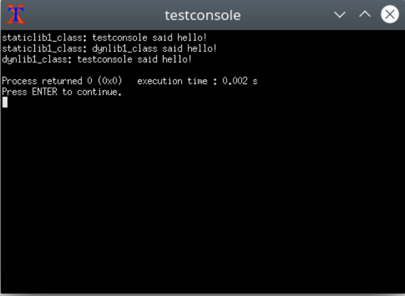
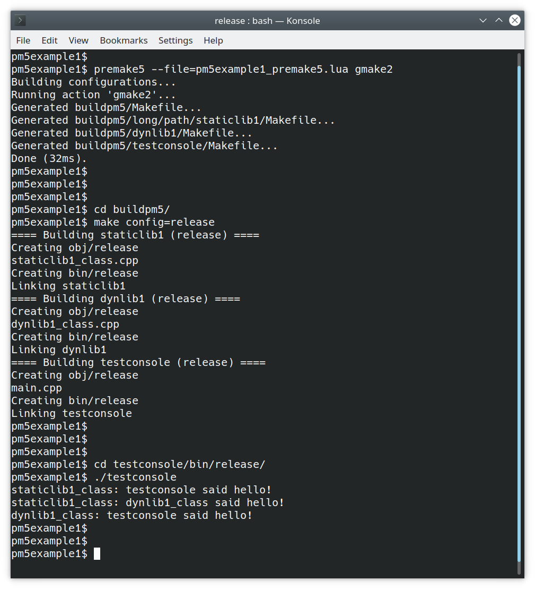

# pm5example1
Example Code::Blocks workspace for Premake5 exporter Code::Blocks plugin

The plugin is found at [https://github.com/arnholm/premake5cb](https://github.com/arnholm/premake5cb)

```

```

## A) Building and running the example workspace from within Code::Blocks 



```

```


## B) Building and running the example workspace using Premake5 

The Premake5 exporter plugin created the file **pm5example1_premake5.lua**. It has not been manually edited.

